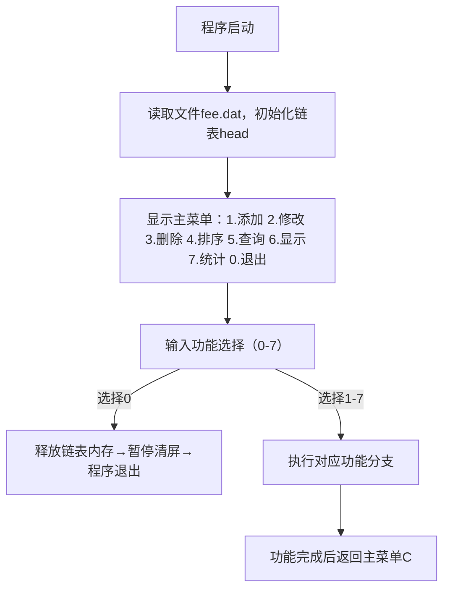

# 1.标题

# 一级标题（一个#后加空格）

## 二级标题（2个#后加空格）

### 三级标题（3个#后加空格）

#### 四级标题（4个#后加空格）

##### 五级标题（5个#后加空格）

###### 六级标题（6个#后加空格）

####### 没有七级标题，后面都是正文

# 2.段落与换行

段落分隔用两空格：哈哈哈哈哈哈哈哈哈和呵呵呵和换行和和换行和和换行和换行和哈哈哈哈哈和和和换行和哈哈哈哈  哈哈哈哈和和换行换行和和

换行符会有一定间距：

呵呵呵

呵呵呵

# 3.强调

*斜体*  _斜体_

**加粗** __加粗__

***斜体加粗*** ___斜体加粗___

`````` 
*斜体* 或 _斜体_
**加粗** 或 __加粗__
***斜体加粗*** 或 ___斜体加粗___
``````

# 4.列表

#### 无序列表（用 +  -  * 后加空格）

+ 项目1（此处用 +）
+ 2
+ 3
+ 4...
  - 子项目1（此处用 -）
  - 2
  - 3...

+ 项目1（此处用 +）
+ 换行会产生连续的点，按“下”键可以跳出列表编辑

* 项目1（此处用 * ）

``````
+ 项目1（此处用 +）
+ 2
+ 3
+ 4...
  - 子项目1（此处用 -）
  - 2
  - 3...

+ 项目1（此处用 +）
+ 换行会产生连续的点，按“下”键可以跳出列表编辑

* 项目1（此处用 * ）
* 2...
``````


#### 有序列表

1. 项目1
2. 2
3. 3...
   1. 子项目1
   2. 2
   3. 3...

``````
1. 项目1
2. 2
3. 3...
   1. 子项目1
   2. 2
   3. 3...
``````

# 5.链接

#### 不添加标题

[哔哩哔哩 (゜-゜)つロ 干杯~-bilibili](https://www.bilibili.com/)

``````
[链接]（网址）
[哔哩哔哩 (゜-゜)つロ 干杯~-bilibili](https://www.bilibili.com/)
``````

#### 加标题

[哔哩哔哩 (゜-゜)つロ 干杯~-bilibili](https://www.bilibili.com/  "B站")

``````
[链接]（网址 "标题"）
[哔哩哔哩 (゜-゜)つロ 干杯~-bilibili](https://www.bilibili.com/ "B站")
``````

# 6.图片

与链接类似，只需在前面加！即可。

图片来源有本地和网络图床，本地的要带附件，网络图床要代理

``````


``````


网络图床：

``````


``````


# 7.引用

引用用>表示，支持嵌套

> 这是一个引用
>
> > 这是嵌套引用
> >
> > > 套娃...

``````
> 这是一个引用
>
> > 这是嵌套引用
> >
> > > 套娃...
``````

# 8.代码块

行内代码用（``）包裹

这是行内代码`Hello World!`示例

``````
这是行内代码`Hello World!`示例
``````

一大块代码用(```)包裹，右下角可以选择语言，方便阅读。

```c
#include <stdio.h>
void main()
{
	printf("Hello World!");
}
```

````
```（回车）
    #include <stdio.h>
    void main()
    {
        printf("Hello World!");
    }
```
````


# 9.表格

| 表头1 | 表头2 |      |
| ----- | ----- | ---- |
| 数据1 |       |      |
| 数据2 |       |      |

```
| 表头1 | 表头2 | 表头3 |
|-------|------|------|
| 数据1 | 数据2 | 数据3 |
| 数据1 | 数据2 | 数据3 |
```

也可以右键选择“插入表格”的功能

# 10.分隔线

***

---

___

```
---
***
___
```

# 11.任务列表

- [ ] 任务一
- [x] 任务二
- [ ] 任务三

```
- [ ] 创建未完成的任务 - [x] 创建已完成的任务 
- [ ] 任务一
- [x] 任务二
- [ ] 任务三
```

# 12.公式

使用两个$符号包裹(latex语法)

$\frac{a}{b}$

可以使用MathType软件

# 13.mermaid绘图

绘制思维导图/流程图(有BUG)

```bash
graph TD
    A[程序启动] --> B[读取文件fee.dat，初始化链表head]
    B --> C[显示主菜单：1.添加 2.修改 3.删除 4.排序 5.查询 6.显示 7.统计 0.退出]
    C --> D[输入功能选择（0-7）]
    D -->|选择0| E[释放链表内存→暂停清屏→程序退出]
    D -->|选择1-7| F[执行对应功能分支]
    F --> G[功能完成后返回主菜单C]
注释：[]方括号里写方块里的内容
	 {}判断语句
	 |判断标志| 显示在流程线上
	  A --> B 流程线从A指向B
	 记得加字母，哪个都行方便链接
```




